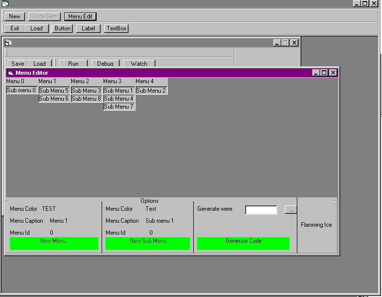



## make a program language

### Description

This code will show you how to create your own programming language.It comes with tons of features and commands and samples also an IDE check out some of it features

Compiler

*Debugging

*Watching

*File Memory-Mapping-emulation

*small Tutorial

*IDE

*Menu editor like visual c++

*Help box like mircosoft word

*File Memory Mapping

*Tons more

*please vote
 
### More Info
 

             |
---                |---
**Submitted On**   |2001-08-03 15:52:30
**By**             |[OpcodeVoid](https://github.com/Planet-Source-Code/PSCIndex/blob/master/ByAuthor/opcodevoid.md)
**Level**          |Advanced
**User Rating**    |4.6 (60 globes from 13 users)
**Compatibility**  |VB 3\.0, VB 4\.0 \(16\-bit\), VB 4\.0 \(32\-bit\), VB 5\.0, VB 6\.0, VB Script
**Category**       |[Complete Applications](https://github.com/Planet-Source-Code/PSCIndex/blob/master/ByCategory/complete-applications__1-27.md)
**World**          |[Visual Basic](https://github.com/Planet-Source-Code/PSCIndex/blob/master/ByWorld/visual-basic.md)
**Archive File**   |[make a pro24036832001\.zip](https://github.com/Planet-Source-Code/opcodevoid-make-a-program-language__1-25829/archive/master.zip)

